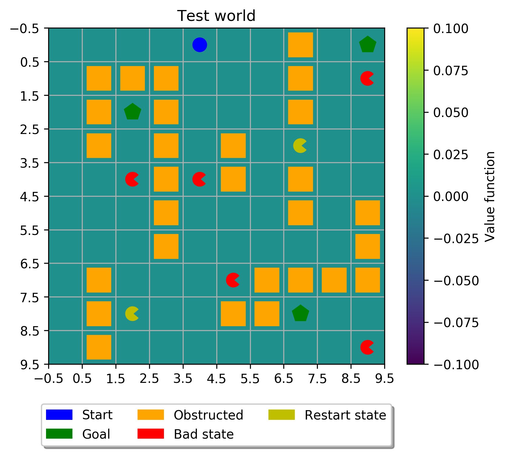
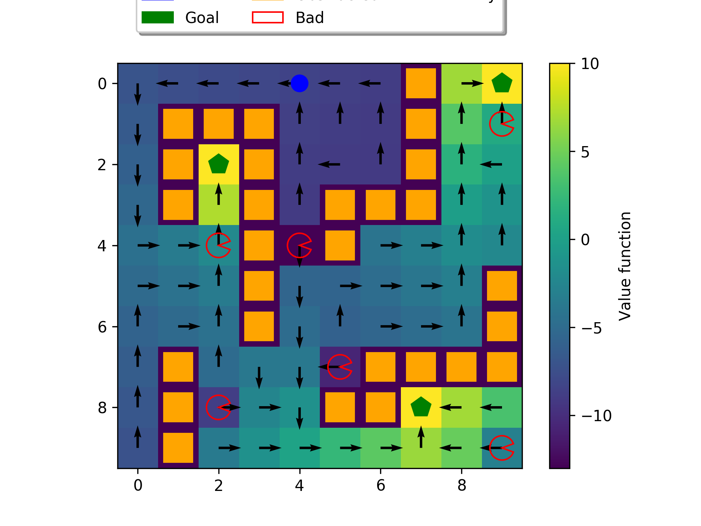

# tabular-methods


[](https://github.com/YannDubs/disentangling-vae/blob/master/LICENSE) 
[](https://www.python.org/downloads/release/python-360/)

This repository is a python implementation of tabular-methods for reinforcement learning with focus on dynamic programming and temporal difference methods.

Notes:
- Tested for python >= 3.5

## Install
```
# clone repo
pip install requirements.txt
```

## Examples
### Create Grid World
This describes the example found in `examples/example_plot_gridworld.py` which illustrates all the
functionality of the `GridWorld` class found in `env/grid_world.py`. It shows how to:

- Define the grid world size by specifying the number of rows and columns.
- Add a single start state.
- Add multiple goal states.
- Add obstructions such as walls, bad states and restart states.
- Define the rewards for the different types of states.
- Define the transition probabilities for the world.

The grid world is instantiated with the number of rows, number of columns, start 
state and goal states:
```
# specify world parameters
num_rows = 10
num_cols = 10
start_state = np.array([[0, 4]]) # shape (1, 2)
goal_states = np.array([[0, 9], 
                        [2, 2], 
                        [8, 7]]) # shape (n, 2)

gw = GridWorld(num_rows=num_rows,
               num_cols=num_cols,
               start_state=start_state,
               goal_states=goal_states)
```

Add obstructed states, bad states and restart states:

- Obstructed states: walls that prohibit the agent from entering that state.
- Bad states: states that incur a greater penalty than a normal step.
- Restart states: states that incur a high penalty and transition the agent 
back to the start state (but do not end the episode).

```
obstructions = np.array([[0,7],[1,1],[1,2],[1,3],[1,7],[2,1],[2,3],
                         [2,7],[3,1],[3,3],[3,5],[4,3],[4,5],[4,7],
                         [5,3],[5,7],[5,9],[6,3],[6,9],[7,1],[7,6],
                         [7,7],[7,8],[7,9],[8,1],[8,5],[8,6],[9,1]]) # shape (n, 2)
bad_states = np.array([[1,9],
                       [4,2],
                       [4,4],
                       [7,5],
                       [9,9]])      # shape (n, 2)
restart_states = np.array([[3,7],
                           [8,2]])  # shape (n, 2)

gw.add_obstructions(obstructed_states=obstructions,
                    bad_states=bad_states,
                    restart_states=restart_states)
```
Define the rewards for the obstructions:

```
gw.add_rewards(step_reward=-1,
               goal_reward=10,
               bad_state_reward=-6,
               restart_state_reward=-100)
```
Add transition probabilities to the grid world.

p_good_transition is the probability that the agent successfully
executes the intended action. The action is then incorrectly executed
with probability 1 - p_good_transition and in tis case the agent
transitions to the left of the intended transition with probability
(1 - p_good_transition) * bias and to the right with probability
(1 - p_good_transition) * (1 - bias).

```
gw.add_transition_probability(p_good_transition=0.7,
                              bias=0.5)
```

Finally, add a discount to the world and create the model. 

```
gw.add_discount(discount=0.9)
model = gw.create_gridworld()
``` 

The created grid world can be viewed with the `plot_gridworld` function in `utils/plots`.

```
plot_gridworld(model, title="Test world")
```



### Dynamic programming

Here the created grid world is solved through the use of the dynamic programming method
value iteration (from `examples/example_value_iteration.py`). See also 
`examples/example_policy_iteration.py` for the equivalent solution via policy iteration.

Apply value iteration to the grid world:

```
# solve with value iteration
value_function, policy = value_iteration(model, maxiter=100)

# plot the results
plot_gridworld(model, value_function=value_function, policy=policy, title="Value iteration")

```
